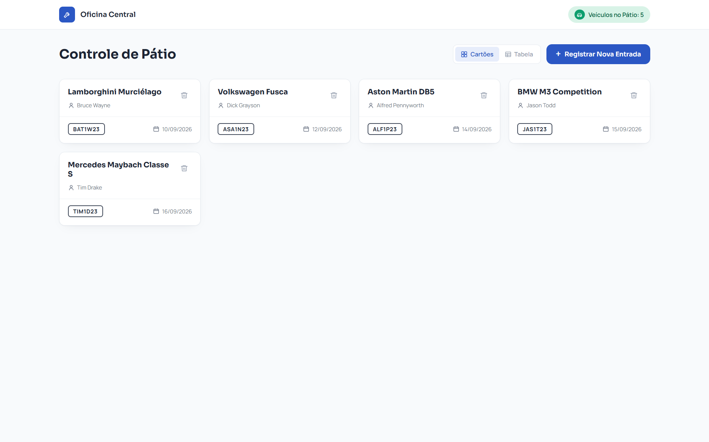
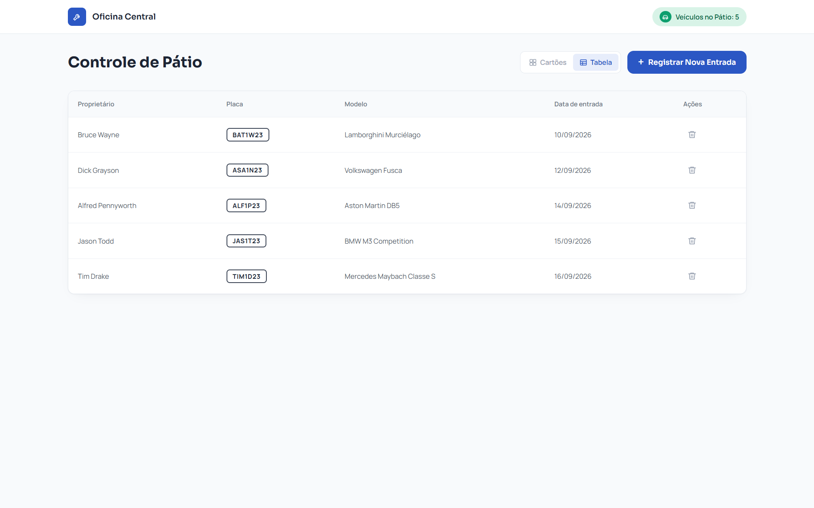
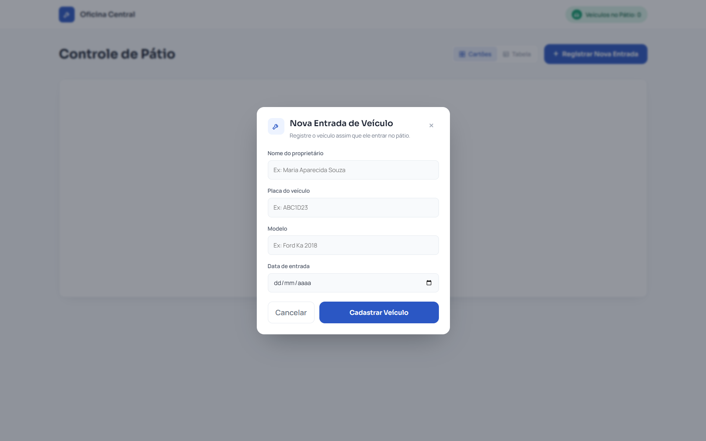
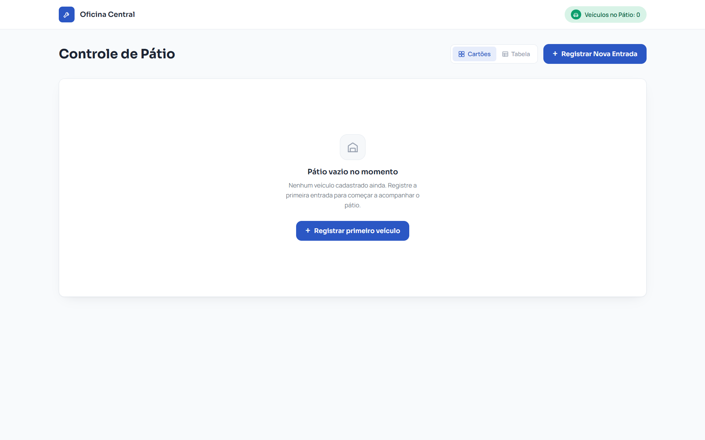
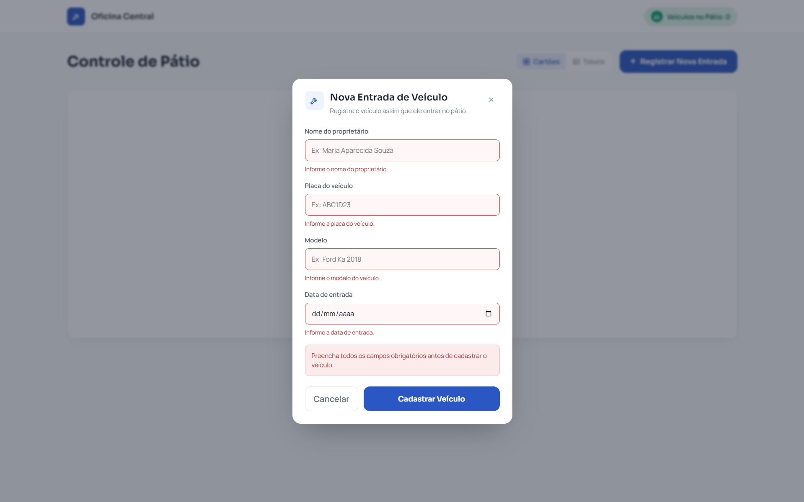
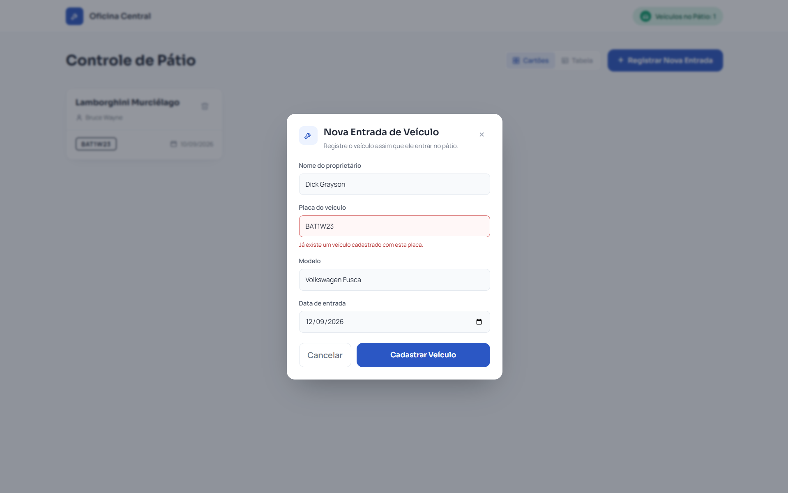
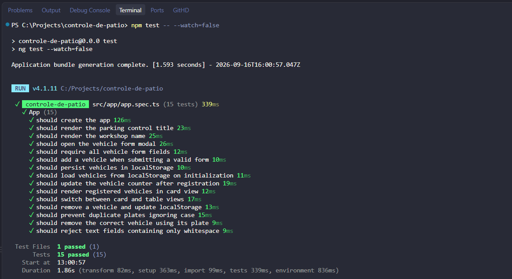

# Controle de Pátio

Aplicação web desenvolvida em **Angular** e **TypeScript** para gerenciamento de veículos presentes no pátio de uma oficina.

O sistema permite registrar entradas de veículos, acompanhar a quantidade presente no pátio, visualizar os registros em diferentes formatos e remover veículos, mantendo os dados persistidos localmente no navegador.

## Demonstração

A aplicação está disponível em produção na Vercel:

**[Acessar Controle de Pátio](https://controle-de-patio-memora.vercel.app)**

### Visualização dos veículos

<p align="center">
  
  
</p>

O sistema oferece duas formas de acompanhamento dos veículos cadastrados:

- **Cartões:** visualização individual e compacta dos veículos;
- **Tabela:** visualização estruturada dos registros em linhas e colunas.

## Cadastro e estado do pátio

<p align="center">
  
  
</p>

O cadastro solicita:

- Nome do proprietário;
- Placa do veículo;
- Modelo;
- Data de entrada.

Quando nenhum veículo está cadastrado, a aplicação apresenta um estado vazio com acesso direto ao registro do primeiro veículo.

## Validações

O formulário possui regras para evitar registros inválidos e inconsistentes.

<p align="center">
  
  
</p>

Entre as validações implementadas estão:

- Todos os campos são obrigatórios;
- Campos de texto contendo apenas espaços são rejeitados;
- A placa é normalizada para letras maiúsculas;
- Não é permitido cadastrar uma placa já existente;
- A verificação de duplicidade ignora diferenças entre letras maiúsculas e minúsculas;
- Campos inválidos apresentam feedback visual ao usuário.

## Funcionalidades

- Cadastro de entrada de veículos;
- Contador atualizado de veículos presentes no pátio;
- Visualização dos veículos em cartões;
- Visualização dos veículos em tabela;
- Alternância entre os modos de visualização;
- Remoção individual de veículos;
- Persistência dos registros com `localStorage`;
- Recuperação automática dos registros ao recarregar a aplicação;
- Validação de campos obrigatórios;
- Rejeição de campos contendo somente espaços;
- Validação de placas duplicadas;
- Normalização das placas cadastradas;
- Feedback visual para dados inválidos;
- Estado específico para pátio vazio;
- Interface responsiva;
- Favicon personalizado.

## Persistência de dados

Os registros são armazenados utilizando o `localStorage` do navegador.

A lista persistida é atualizada sempre que um veículo é cadastrado ou removido. Ao iniciar a aplicação, os dados armazenados são recuperados automaticamente.

A solução mantém a aplicação compatível com o escopo proposto sem exigir backend ou banco de dados externo.

## Testes automatizados

O projeto possui **15 testes automatizados** para os principais comportamentos e regras da aplicação.

Entre os cenários testados estão:

- Inicialização da aplicação;
- Renderização da interface;
- Abertura do formulário;
- Validação dos campos obrigatórios;
- Cadastro de veículos;
- Persistência no `localStorage`;
- Recuperação dos registros armazenados;
- Atualização do contador;
- Renderização dos veículos em cartões;
- Alternância entre cartões e tabela;
- Remoção de veículos;
- Atualização do `localStorage` após remoção;
- Bloqueio de placas duplicadas ignorando maiúsculas e minúsculas;
- Remoção do veículo correto pela placa;
- Rejeição de campos contendo somente espaços.

<p align="center">
  
</p>

Resultado:

```text
Test Files  1 passed (1)
Tests       15 passed (15)
```

## Tecnologias utilizadas

- Angular 22
- TypeScript
- HTML5
- CSS3
- Angular Reactive Forms
- localStorage
- Vitest
- Prettier
- Vercel

## Estrutura do projeto

```txt
controle-de-patio/
├── .vscode/
│   ├── extensions.json
│   ├── settings.json
│   └── tasks.json
├── assets/
│   └── prints/
│       ├── automated-tests.png
│       ├── card-view.png
│       ├── duplicate-plate-validation.png
│       ├── empty-state.png
│       ├── required-validation.png
│       ├── table-view.png
│       └── vehicle-form.png
├── public/
│   └── favicon.svg
├── src/
│   ├── app/
│   │   ├── app.config.ts
│   │   ├── app.css
│   │   ├── app.html
│   │   ├── app.spec.ts
│   │   └── app.ts
│   ├── index.html
│   ├── main.ts
│   └── styles.css
├── .editorconfig
├── .gitignore
├── .prettierrc
├── angular.json
├── package-lock.json
├── package.json
├── README.md
├── tsconfig.app.json
├── tsconfig.json
└── tsconfig.spec.json
```
